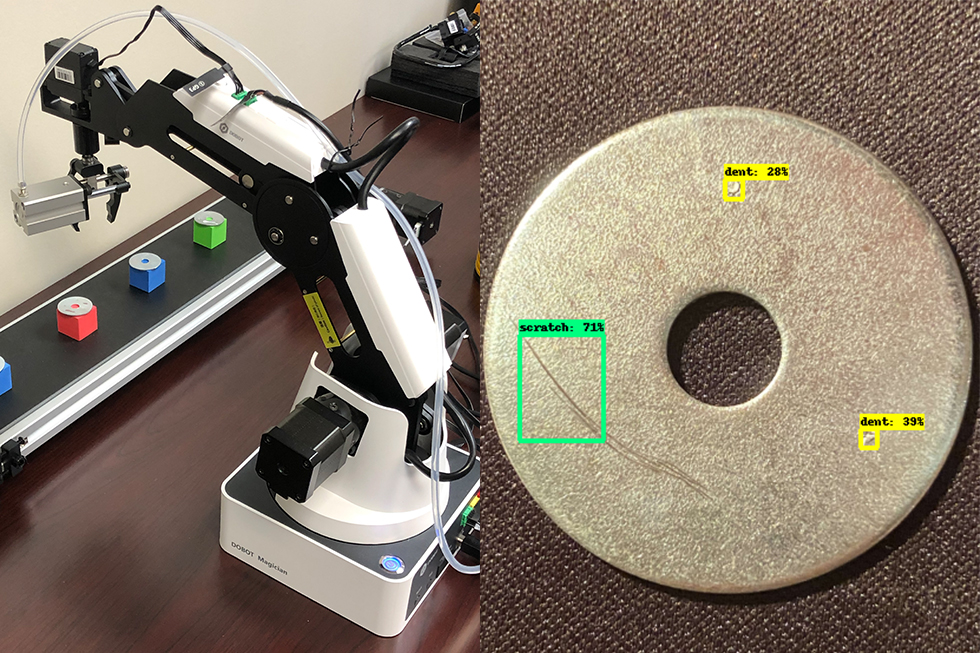
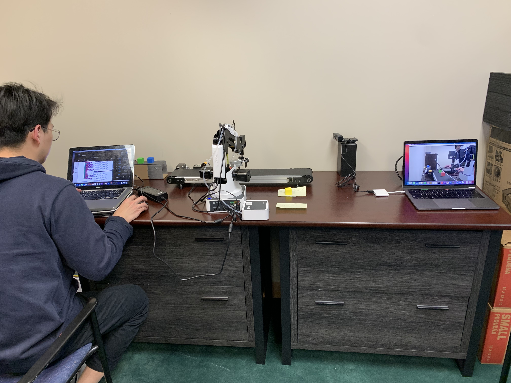
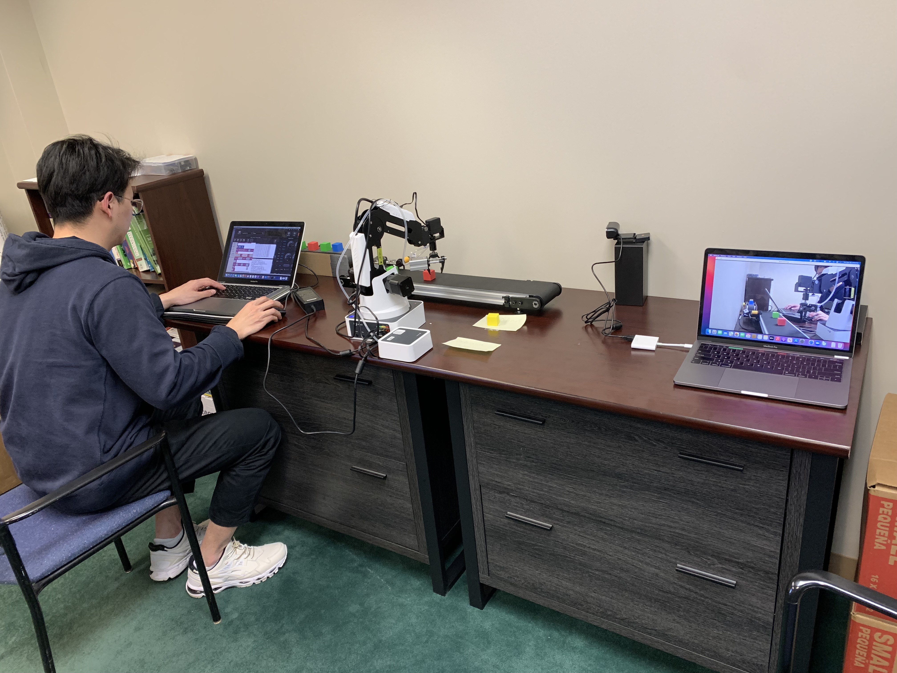
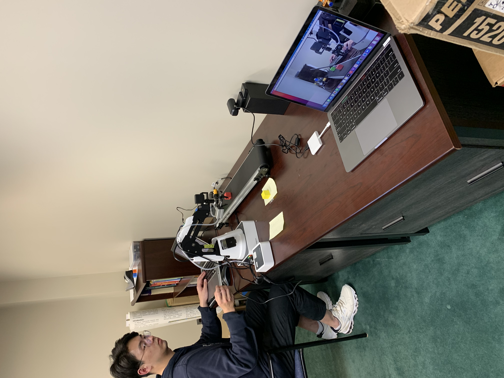

# Metallic Surfaces Defect Detection and Classification

**Author:** Youxin Zhuo ([SmashCodeJJ](https://github.com/SmashCodeJJ))  
**Institution:** Penn State University · Acura Research Project  
**Domain:** Computer Vision · Object Detection · Manufacturing QA · Robotics

---

## Overview

This project simulates a **manufacturing quality inspection** pipeline: detecting and classifying defects on metallic washer surfaces using deep learning, then deploying the trained model on a **robotic arm + conveyor belt** system for automated pick-and-sort.

Defect types include scratches, dents, paint marks, and glue residue applied to real washer samples for dataset creation.

---

## Pipeline

```
Data Collection → Image Processing → Model Training → Robotic Deployment
     │                  │                  │                    │
  Webcam +          Resize, crop,      SSD MobileNet V2     Dobot arm +
  custom washers    label images       (TensorFlow)         conveyor + laser sensor
```

### 1. Dataset Collection

- Purchased metal washers and manually created defects (scratches, dents, paint, glue marks)
- Captured images via webcam for both **defect** and **non-defect** samples
- Organized images into labeled folders for training

### 2. Image Processing

- Resized and cropped objects from raw images
- Labeled images using annotation tools
- Extracted visual features for model input

### 3. Model Training

- Used **SSD MobileNet V2** pre-trained on COCO dataset as base checkpoint
- Replaced COCO classes with custom defect/non-defect labels
- Trained using **TensorFlow Object Detection API** (TFOD)
- Built a custom object detection model for metallic surface inspection

### 4. Robotic Arm Deployment

- Integrated trained model with a **Dobot robotic arm**
- Conveyor belt with laser sensor triggers inspection
- Arm picks and sorts items based on defect classification
- Blockly programs control conveyor motion and pick sequences

---

## Results

The SSD MobileNet V2 model successfully detects and classifies defect vs non-defect washers in real time. The system was deployed on hardware combining:

- **Hikvision industrial camera** for image capture
- **Dobot Magician** robotic arm for pick-and-place
- **Conveyor belt** with laser sensor for item triggering

<p align="center">
  
</p>

### Sample Dataset Images

<p align="center">
  
  
  
</p>

---

## Repository Structure

```
metallic-surface-defect-detection/
├── README.md
├── requirements.txt
├── .gitignore
├── notebooks/
│   ├── 01_image_collection.ipynb      # Webcam data collection
│   └── 02_training_and_detection.ipynb # SSD MobileNet V2 training (TFOD)
├── robotic_arm/
│   ├── project_pick.blockly           # Robotic arm pick sequence
│   ├── Project - conveyor .blockly    # Conveyor belt control
│   ├── Check_Sensor.blockly           # Laser sensor check
│   └── dobot_mbnv3/                   # MobileNetV3 + Dobot integration
│       ├── dobot_mbnV3.py
│       ├── model_v3.py
│       └── class_indices.json
└── docs/
    ├── images/                        # Sample dataset photos
    └── veu9_kjg5854_...jpg            # Research poster
```

---

## Technologies

| Component | Technology |
|-----------|------------|
| Object Detection | TensorFlow Object Detection API, SSD MobileNet V2 |
| Pre-trained Model | COCO checkpoint (`ssd_mobilenet_v2_fpnlite_320x320_coco17_tpu-8`) |
| Image Processing | OpenCV |
| Robotic Control | Dobot Magician SDK, Blockly |
| Camera | Hikvision industrial camera (MVS SDK) |
| Classification (alt.) | MobileNetV3 (Keras/TensorFlow) |

---

## Getting Started

### 1. Clone the repository

```bash
git clone https://github.com/SmashCodeJJ/metallic-surface-defect-detection.git
cd metallic-surface-defect-detection
```

### 2. Set up TensorFlow Object Detection

Follow the [TFOD Course setup](https://github.com/nicknochnack/Tensorflow-Object-Detection-API) to install:

- TensorFlow 2.x
- TensorFlow Object Detection API
- Protobuf compiler

### 3. Collect training images

Run `notebooks/01_image_collection.ipynb` to capture labeled images via webcam.

### 4. Train the model

Run `notebooks/02_training_and_detection.ipynb` which:

1. Downloads the SSD MobileNet V2 COCO checkpoint
2. Generates TFRecords from annotated images
3. Configures and trains the custom detection model
4. Exports the trained model for inference

### 5. Deploy on robotic arm

Use the Blockly programs in `robotic_arm/` with Dobot Studio, or run `robotic_arm/dobot_mbnv3/dobot_mbnV3.py` for MobileNetV3-based classification with the Dobot arm.

### 6. Analyze sample images (OpenCV preprocessing demo)

```bash
python scripts/analyze_sample_images.py
```

Generates edge maps and `results/image_analysis/analysis_summary.json` from sample washer photos.

---

## Research Context

This project was part of the **Acura Research Program** at Penn State, investigating machine learning for manufacturing quality control. Related literature on metallic surface defect detection is included in the original research folder.

**Defect types studied:**
- Scratches
- Dents
- Paint marks
- Glue residue

---

## Key Learnings

- **Transfer learning accelerates custom detection:** COCO pre-trained SSD MobileNet V2 adapts well to small custom manufacturing datasets.
- **End-to-end pipeline:** From physical sample creation → annotation → training → robotic deployment demonstrates a complete ML systems workflow.
- **Hardware integration:** Combining computer vision with industrial robotics (Dobot + conveyor) mirrors real factory QA automation.

---

## Future Work

- Expand dataset with more defect categories and lighting conditions
- Evaluate YOLO and Faster R-CNN for comparison
- Real-time edge deployment on Jetson or industrial PC
- Add model versioning and MLOps pipeline

---

## License

Academic research project — Penn State University / Acura Research Program.
